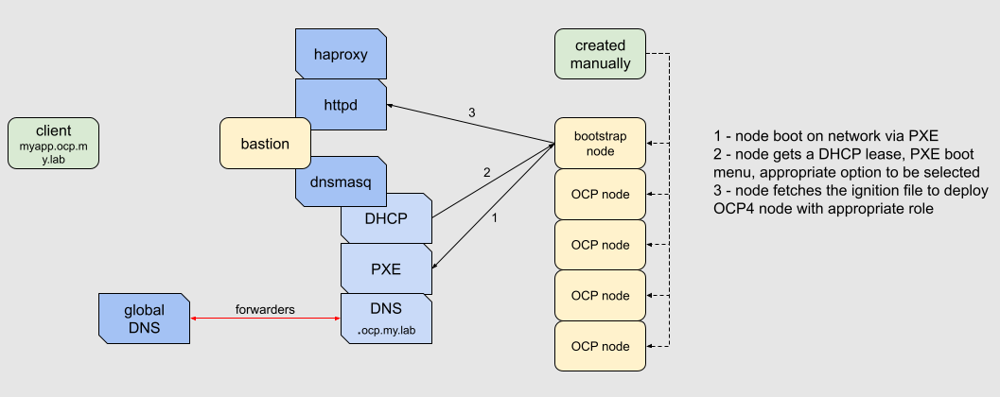
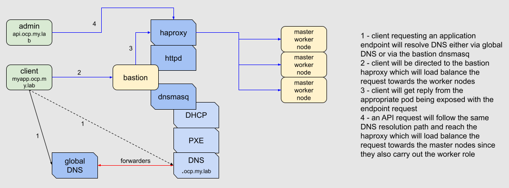

# OpenShift Container Platform 4 Lab
This set of ansible plays provides the necessary automation to deploy a Red Hat OpenShift Container Platform v4.x (OCP4) lab environment using the bare metal UPI method.
Doing so provides a platform agnostic approach which will fit any on-prem or cloud based (supported or not) deployment. 

Notes: 
0. knowledge of OCP installation is required, this is not (yet) a fully assisted deployment but also a basic understanding of linux, dnsmasq, httpd, haproxy for potential customizations 
1. a bastion host with 2vCPUs, 4GB RAM, and 30GB HDD should be sufficient running CentOS/RHEL7.x.
2. if RHEL is used, valid subscriptions are required.
3. the Red Hat variant of OCP4 requires a valid subscription after the 60 days of trial.

## bastion overview
The automation requires one CentOS (virtual) machine that provides the following services:
- DNS
- DHCP
- PXE
- HTTPD
- HAPROXY

These services will help in provisioning and accessing the OCP4 environment. The following diagram  provides a provisioning workflow overview within the current state of the project:



Note: the DNS and HAPROXY services are only for a lab environment within a self-contained bubble. If this automation is foreseen for a production deployment, the corporate DNS and load balancers should be used.

This next diagram provide an access workflow overview within the current state of the project:



The following (virtual) machine will be required:
- 1 (virtual) machine for the bastion host.
- 1 (virtual) machine for the bootstrap, it will be decommissioned at the end of the deployment.
- 3 (virtual) machine for the master nodes acting. These can also act as workers.
- 2 (virtual) machine for the worker nodes. 
Except for the bastion, all the (virtual) machine will be configured to boot from network as first option. The provided PXE boot menu will boot on the local drive if there isn't any actions.

## prerequisites 
Once the bastion host is available, make sure the bastion to connect via a SSH key pair. 

### get ocp4-lab
To get a local copy of the git repo, perform the following:

```shell
git clone https://github.com/rovandep/ocp4-lab.git
```

### parameters_setup.yaml

First of all, if the bastion host is RHEL based, make sure the (V)M is registered and can install packages. If not, fix this first!

Prior to start any plays, a couple of parameters are required to be defined within the "parameters_setup.yaml". 

The following parameters are used to customized the OCP4 cluster. The
clustername: "cluster"
labdomain: "my.lab"

The following parameters are used to customized the DHCP servers and fit your network. 
dhciprange: "192.168.100"
ptriprange: "100.168.192"
dhcprange: "{{ dhcpiprange }}.20,{{ dhcpiprange }}.30,24h"
dhcproute: "{{ dhcpiprange }}.1"
Note: don't change/remove {{ dhcpiprange }} from dhcprange or dhcproute unless you know what you're doing.

### The play
Edit the inventory file to target your infra virtual machine.
Then, run the play after customizing "parameters_setup.yml" with the following command:

```
$ ansible-playbook -i inventory -e @parameters_lab_setup.yml lab_setup.yml
```

The following output is expected:

```
$ ansible-playbook -i inventory -e @../parameters_lab_setup.yml lab_setup.yml 

PLAY [DNSDHCP] ******************************************************************************

TASK [sysprep : Verify if host is already registered] ***************************************
changed: [192.168.100.10]

TASK [sysprep : debug] **********************************************************************
skipping: [192.168.100.10]

TASK [sysprep : Subscribe to RHN] ***********************************************************
skipping: [192.168.100.10]

TASK [sysprep : Disable Repositories] *******************************************************
changed: [192.168.100.10]

TASK [sysprep : Enable Repositories] ********************************************************
changed: [192.168.100.10]

TASK [sysprep : Update system] **************************************************************
ok: [192.168.100.10]

TASK [sysprep : Install all required packages for Infra Services VM] ************************
ok: [192.168.100.10]

TASK [sysprep : Configure firewall for httpd] ***********************************************
ok: [192.168.100.10] => (item=dns)
ok: [192.168.100.10] => (item=dhcp)
ok: [192.168.100.10] => (item=http)
ok: [192.168.100.10] => (item=tftp)

TASK [httpd : Inject configuration file] ****************************************************
ok: [192.168.100.10]

TASK [Enabling httpd service] ***************************************************************
ok: [192.168.100.10]

TASK [ocp : Create OCP temp directory] ******************************************************
ok: [192.168.100.10]

TASK [ocp : Unarchive latest openshift installer] *******************************************
ok: [192.168.100.10]

TASK [ocp : Unarchive latest openshift cli command] *****************************************
ok: [192.168.100.10]

TASK [ocp : Create installation directory] **************************************************
ok: [192.168.100.10]

TASK [ocp : Inject installation template] ***************************************************
changed: [192.168.100.10]

TASK [ocp : Call openshift-installer to create manifest] ************************************
changed: [192.168.100.10]

TASK [ocp : Call openshift-installer to create ignition config files] ***********************
changed: [192.168.100.10]

TASK [ocp : Create RHCOS directory] *********************************************************
ok: [192.168.100.10]

TASK [ocp : Create RHCOS directory] *********************************************************
ok: [192.168.100.10]

TASK [ocp : Create RHCOS directory] *********************************************************
ok: [192.168.100.10]

TASK [ocp : Download latest RHCOS iso] ******************************************************
ok: [192.168.100.10]

TASK [ocp : Download latest RHCOS raw] ******************************************************
ok: [192.168.100.10]

TASK [ocp : Download latest RHCOS kernel] ***************************************************
ok: [192.168.100.10]

TASK [ocp : Download latest RHCOS initramfs] ************************************************
ok: [192.168.100.10]

TASK [dnsmasq : fixing permissions] *********************************************************
[WARNING]: Consider using the file module with mode rather than running 'chmod'.  If you
need to use command because file is insufficient you can add 'warn: false' to this command
task or set 'command_warnings=False' in ansible.cfg to get rid of this message.
changed: [192.168.100.10]

TASK [dnsmasq : fixing permissions] *********************************************************
changed: [192.168.100.10]

TASK [Inject dnsmasq configuration file] ****************************************************
changed: [192.168.100.10]

TASK [dnsmasq : Inject hosts configuration file] ********************************************
ok: [192.168.100.10]

TASK [dnsmasq : Copy syslinux file for tftp server usage] ***********************************
changed: [192.168.100.10]

TASK [dnsmasq : Inject default pxelinux configuration file] *********************************
changed: [192.168.100.10]

TASK [Enabling dnsmasq service] *************************************************************
changed: [192.168.100.10]

TASK [Inject haproxy configuration file] ****************************************************
changed: [192.168.100.10]

TASK [Enabling haproxy service] *************************************************************
changed: [192.168.100.10]

PLAY RECAP **********************************************************************************
192.168.100.10             : ok=31   changed=14   unreachable=0    failed=0    skipped=2    rescued=0    ignored=0   
``` 

When the play is successful within your setup, you modify your local resolv.conf and target the infra vm and then do the following tests:

```
$ curl 192.168.100.10:8080/ocp-installer
```
The above should return the html output for listing the content of the directory which should be the following if you do a browser check:

```
Index of /ocp-installer
Parent Directory
README.md
cluster/
openshift-install
``` 

Then do a DNS check as follow:
```
$ for i in {apps,myshiny.apps,api,api-int}; do nslookup $i.cluster.my.lab;done
Server:		192.168.100.10
Address:	192.168.100.10#53

Name:	apps.cluster.my.lab
Address: 192.168.100.10

Server:		192.168.100.10
Address:	192.168.100.10#53

Name:	myshiny.apps.cluster.my.lab
Address: 192.168.100.10

Server:		192.168.100.10
Address:	192.168.100.10#53

Name:	api.cluster.my.lab
Address: 192.168.100.10

Server:		192.168.100.10
Address:	192.168.100.10#53

Name:	api-int.cluster.my.lab
Address: 192.168.100.10

```
Note: none can fail otherwise OCP4 deployment fail and/or not usable

At this stage, do you a HAproxy check is almost useless as there is not application behin however the following should be expected:

```
$ curl api.cluster.my.lab
curl: (52) Empty reply from server
``` 
If there is any other responses, then the play log output needs to be analyzed.


### Lab creation
Now that the infra virtual machine is running with all the appropriate services, the bootstrap virtual machine can be started with as boot sequence network then disk to allow PXE boot.

When the PXE boot menu appears select "1) OCP4 bootstrap", the virtual machine will boot, then deploy RHCOS with the bootstrap ignition configuration file generated with the play and then reboot itself. 
When the machine reboot itself, do not touch any key on the keyboard, when the timeout will occur on the PXE boot menu, the bootstrap virtual machine will boot on its local disk with the freshly install RHCOS.

Repeat the process for the 3 master/worker nodes by selecting "2) OCP4 master" entry.

At this stage, the 3 master/worker nodes will connect with the bootstrap VM and start their deployment as such to form the OCP4 cluster. This process can take between 5 to 40 minutes depending on the allocated resoources to the respective virtual machines.

To monitor the "progress", you can ssh to your infra virtual machine, and do the followings:

```
$ cd /var/www/html/ocp-installer
$ sudo ./openshift-install --dir=cluster wait-for bootstrap-complete --log-level debug
DEBUG OpenShift Installer 4.5.13                   
DEBUG Built from commit 9893a482f310ee72089872f1a4caea3dbec34f28 
INFO Waiting up to 20m0s for the Kubernetes API at https://api.cluster.my.lab:6443... 
DEBUG Still waiting for the Kubernetes API: Get https://api.cluster.my.lab:6443/version?timeout=32s: EOF 
DEBUG Still waiting for the Kubernetes API: the server could not find the requested resource 
DEBUG Still waiting for the Kubernetes API: the server could not find the requested resource 
DEBUG Still waiting for the Kubernetes API: Get https://api.cluster.my.lab:6443/version?timeout=32s: EOF 
INFO API v1.18.3+47c0e71 up                       
INFO Waiting up to 40m0s for bootstrapping to complete... 
DEBUG Bootstrap status: complete                   
INFO It is now safe to remove the bootstrap resources 
DEBUG Time elapsed per stage:                      
DEBUG Bootstrap Complete: 13m36s                   
DEBUG                API: 1m25s                    
INFO Time elapsed: 13m36s                             
```

When the above message appears, the bootstrap machine can be stopped and remove from the loadbalancer.

Then, while still being in the same directory, do the followings to verify connectivity to the cluster:

```
$ export KUBECONFIG=auth/kubeconfig
$ oc whoami
system:admin
$ oc get nodes
NAME                        STATUS   ROLES           AGE   VERSION
ocp-mst-01.cluster.my.lab   Ready    master,worker   36m   v1.18.3+47c0e71
ocp-mst-02.cluster.my.lab   Ready    master,worker   33m   v1.18.3+47c0e71
ocp-mst-03.cluster.my.lab   Ready    master,worker   38m   v1.18.3+47c0e71

``` 

At this stage, follow the remaining of the documentation: https://docs.openshift.com/container-platform/4.5/installing/installing_bare_metal/installing-bare-metal.html#installation-approve-csrs_installing-bare-metal which should not take more than 10-15 minutes.

Once you're done with the last steps, you can start create a project or connect to the console via the url https://console-openshift-console.apps.cluster.my.lab based on the above parameters example, so change clustername (here cluster) and the labdomain (here my.lab) to match yours.
 
## TODO
1. allow a setup with an external DHCP server
2. allow a setup with an external DNS server
3. allow a setup with an external PXE server
4. allow a setup with an external LoadBalancer
5. change the fix permission with a more elegant solution
6. automatic VM creation on libvirt
7. ~~modify the dnsmasq_conf.j2 MAC address entry with a variable to be set in the parameters_setup.yml file~~
8. create a play for the post boostrap steps
9. implementing a delete of the existing deployment in case of redeployment to avoid certificate like x509: certificate has expired or is not yet valid
